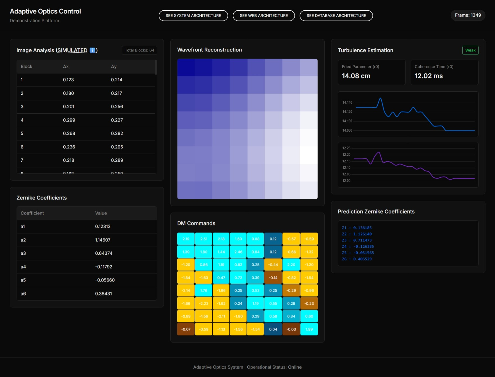
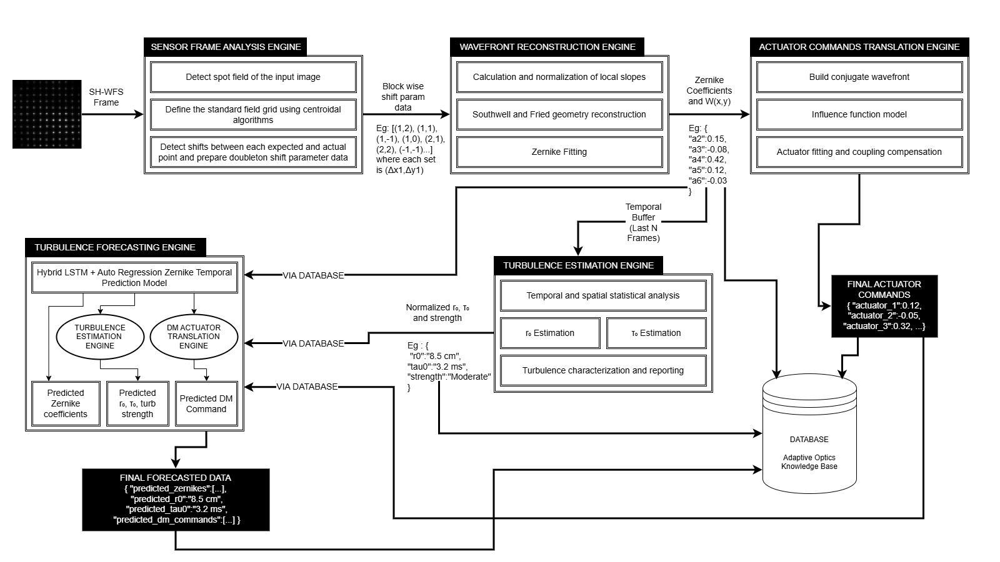
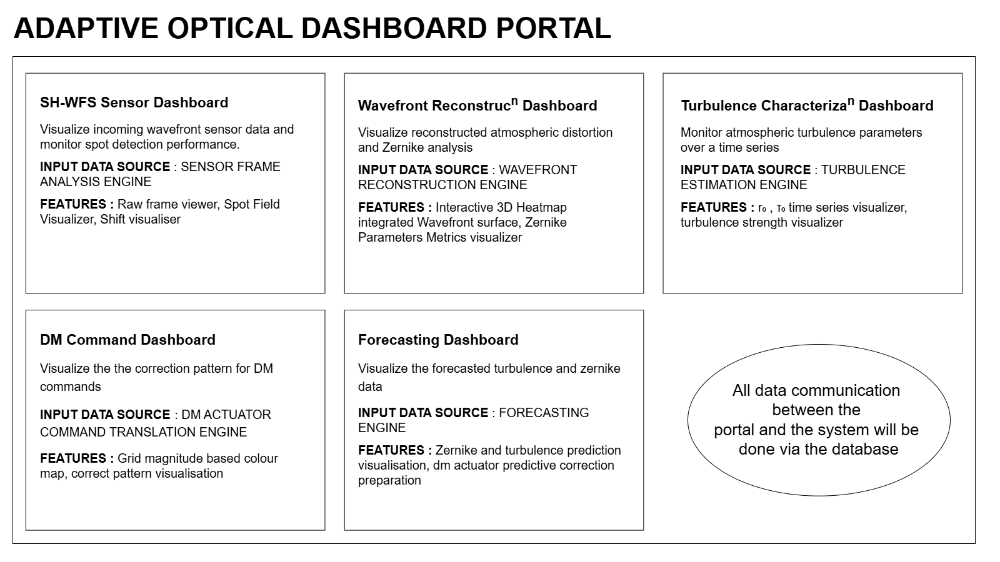
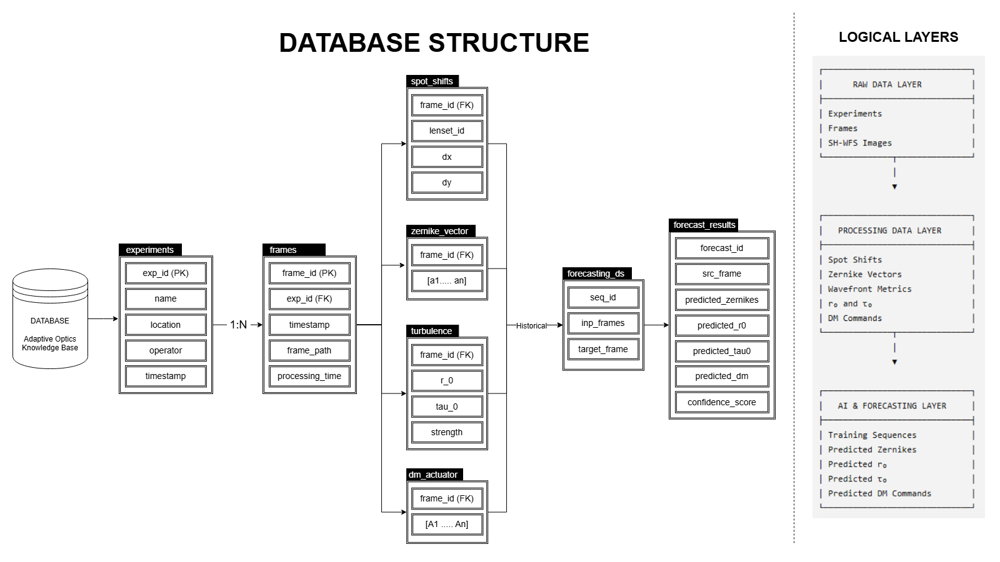
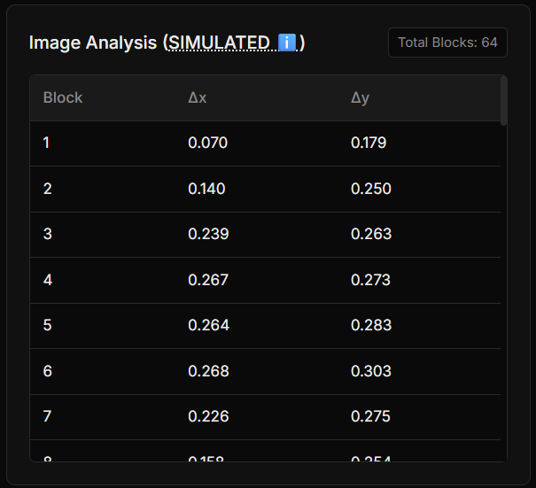
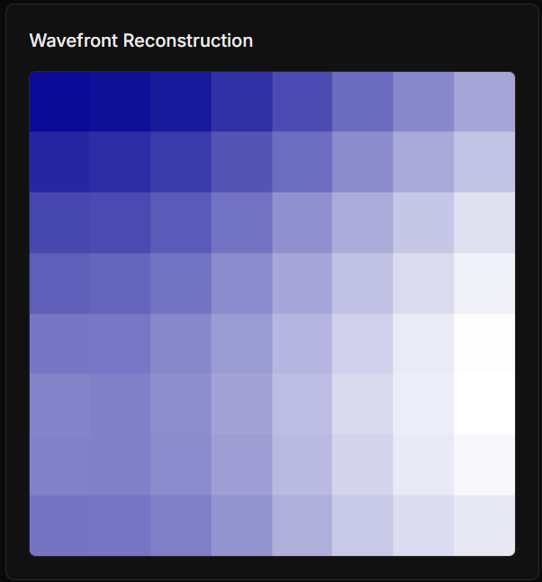
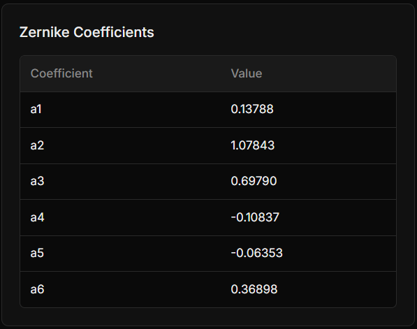
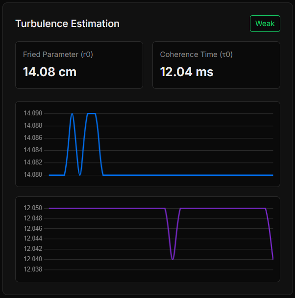
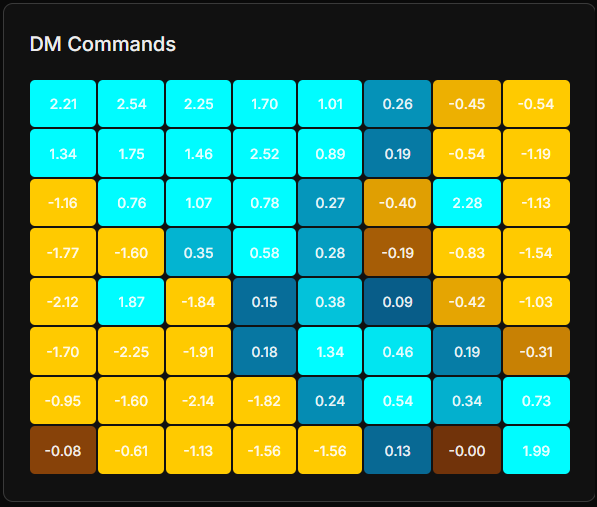
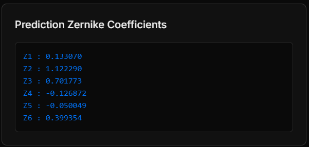

# BAH - MVP - Team AlgoRhythmmm
> Wavefront Reconstruction, DM Control, Turbulence Characterisation and Forecasting

<a style="display:block; width: fit-content; border:0; background: #00ccff; color: #fff; padding: 10px 20px; border-radius: 50px; font-family: 'arial'; letter-spacing: 1px; text-decoration: none; margin: 25px 0; =" href="https://docs.google.com/presentation/d/1bONYWeurhWJO1tGv1b5jdY-nArSsAXbnjnjfiqRyBd4/edit?usp=sharing">SUBMITTED PPT (SYNOPSIS) ↗️</a>

## Digital Twin Web Portal

**An Intelligent Adaptive Optics Framework for Wavefront Reconstruction, Atmospheric Turbulence Estimation, Predictive Forecasting and Deformable Mirror Control**

### Main Dashboard



LIVE WORKING VIDEO - https://youtu.be/y83JkbjsCfo

---

## Overview

The Adaptive Optics Monitoring and Analysis Portal is a complete software framework that transforms raw Shack-Hartmann Wavefront Sensor (SH-WFS) images into deformable mirror correction commands while providing real-time visualization, atmospheric turbulence estimation, predictive forecasting, and system analytics.

The platform integrates the complete adaptive optics pipeline into a unified monitoring environment, enabling researchers to observe every stage of the wavefront sensing and correction process.

---

# MVP Features

- SH-WFS Image Analysis (Simulated)
- Wavefront Reconstruction
- Zernike Coefficient Extraction
- Atmospheric Turbulence Estimation
- Deformable Mirror Actuator Mapping
- LSTM-based Turbulence Prediction

---

# System Architecture and Flow Diagrams






---

# INDIVIDUAL FEATURE EXPLANATION

## SH-WFS Sensor Dashboard

>**Visualize incoming wavefront sensor data and monitor spot detection performance.**



* **INPUT DATA SOURCE** : SENSOR FRAME  ANALYSIS ENGINE

* **FEATURES** : Raw frame viewer, Spot Field Visualizer, Shift visualiser

ℹ️ Actual sensor frame image analysis functionalities couldn't be developed at the moment due to the absence of specified frame format and data

## Wavefront Reconstruction Dashboard
>**Visualize reconstructed atmospheric distortion and Zernike analysis**




* **INPUT DATA SOURCE** : WAVEFRONT RECONSTRUCTION ENGINE

* **FEATURES** : Interactive Heatmap integrated Wavefront surface, Zernike Parameters Metrics visualizer

## Turbulence Characterization Dashboard
>**Monitor atmospheric turbulence parameters over a time series**



* **INPUT DATA SOURCE** : TURBULENCE ESTIMATION ENGINE

* **FEATURES** : r₀ , τ₀ time series visualizer, turbulence strength visualizer

## DM Command Dashboard
>**Visualize the the correction pattern for DM commands**



* **INPUT DATA SOURCE** : DM ACTUATOR COMMAND TRANSLATION ENGINE

* **FEATURES** : Grid magnitude based colour map, correct pattern visualisation

## Forecasting Dashboard
>**Visualize the forecasted turbulence and zernike data**



* **INPUT DATA SOURCE** : FORECASTING ENGINE

* **FEATURES** : Zernike and turbulence prediction visualisation, dm actuator predictive correction preparation


# PROJECT STRUCTURE

```text
Adaptive-Optics-Control-System/
│
├── assets/                         # Demo videos, architecture diagrams, project media
│
├── data/
│   └── synthetic/                  # Rolling Zernike coefficient dataset
│
├── engines/
│   ├── image_analysis_simulation.py
│   ├── wavefront_reconstruction_engine.py
│   ├── turbulence_estimation_engine.py
│   └── dm_translation_engine.py
│
├── extras/                         # Supplementary documents and MVP resources
│
├── models/
│   ├── model.py                    # LSTM model architecture
│   ├── ar_model.py                 # Autoregressive model
│   └── lstm_model.pth              # Trained model weights
│
├── results/                        # Generated outputs, logs and evaluation results
│
├── static/                         
│
├── templates/
│   └── index.html
│
├── ar_model.py                     # Main architecture for ar model
├── model.py                        # Main architecture for LSTM model
├── config.py                       # Global configuration parameters
├── draft_image.py                  # Image processing utility
├── locks.py                        # Thread synchronization utilities
├── main.py                         # Flask application entry point
├── predict.py                      # Future Zernike coefficient prediction
├── prediction_manager.py           # Prediction scheduling & model retraining
├── train.py                        # LSTM training pipeline
├── train_ar.py                     # Autoregressive model training
│
├── requirements.txt
├── README.md
├── LICENSE
└── .gitignore
```

## Directory Overview

| Directory / File | Description |
|------------------|-------------|
| **assets/** | Stores demonstration videos, architecture diagrams, and project media. |
| **data/** | Contains rolling datasets used for training and real-time prediction. |
| **engines/** | Implements the Adaptive Optics pipeline, including image analysis, wavefront reconstruction, turbulence estimation, and deformable mirror control. |
| **extras/** | Supplementary documentation and MVP resources. |
| **models/** | Contains machine learning model definitions and trained model weights. |
| **results/** | Stores generated outputs, benchmarks, and performance metrics. |
| **static/** | Frontend JavaScript, CSS, images, and other static assets. |
| **templates/** | HTML templates used by the Flask dashboard. |
| **main.py** | Launches the Flask server and coordinates the complete Adaptive Optics workflow. |
| **prediction_manager.py** | Handles asynchronous prediction scheduling and periodic model retraining. |
| **predict.py** | Performs real-time future Zernike coefficient prediction using the trained model. |
| **train.py / train_ar.py** | Train the LSTM and Autoregressive forecasting models. |
| **config.py** | Stores configurable hyperparameters and application settings. |
| **locks.py** | Provides thread synchronization to ensure safe concurrent access to shared resources. |
| **requirements.txt** | Lists all Python dependencies required to run the project. |
